# Claude Code Token Usage & Quota Guide

An in-depth breakdown of how Claude Code calculates operational usage, balances resource limits, and optimizes cost structures during live development sessions.

---

## 1. Architectural Token Flow

When interacting with Claude Code, your text prompts and system instructions scale across a dual-tier token network. The pipeline optimizes efficiency by splitting data into fresh and cached states:

```mermaid
graph TD
    subgraph Input ["Total Session Input Payload"]
        A[📥 Fresh Prompt Input<br/>e.g., 142 Tokens]
        B[💾 Cached Context Reads<br/>e.g., 5.3 Million Tokens]
    end

    Input --> C[📤 Session Output Generation<br/>e.g., 385 Tokens]

    style Input fill:#1a1a24,stroke:#3b3b4f
    style C fill:#112211,stroke:#22aa55
```



| Metric Type | Resource Payload (Example) | Core Functional Behavior |
| --- | --- | --- |
| 📥 Fresh Inputs | 142 in | The raw, un-cached character data payload submitted during your latest terminal command. |
| 💾 Cache Reads | 5.3M cache read | Existing project states, rules, and history pulled instantaneously from server memory at a 90% discount. |
| 📤 Gen Outputs | 385 out | Concrete code blocks, terminal diff sequences, and text synthesized by the model to fulfill your request. |

---

## 2. Deep-Dive: Prompt Caching (5.3M cache read vs 124.1k cache write)

**What it means:** Claude Code relies heavily on Prompt Caching. Instead of compiling your entire repository history, system configurations, and past file changes from scratch on every turn, it stores a snapshot of your project state in server memory.

**The Savings Impact:** The metrics above show an incredibly efficient ratio: 5,300,000 tokens were read directly from the cache, while only 124,100 tokens had to be freshly written. Because cached reads cost up to 90% less than standard input tokens, a multi-million token context operation was completed for a raw cost of just $1.56.

---

## 3. Quota Register Mechanics

To protect processing bandwidth while ensuring smooth localized workflow execution, Claude Code partitions your resource allocations into three distinct, concurrent tracking registries:

### 🕒 session-0 (Short-Term Burst Quota)

- **Behavior:** Tracks high-frequency, localized console messaging cycles.
- **Refresh Cycle:** Operates on a shifting, multi-hour window. If your active session context spikes rapidly during a heavy debugging loop, this safety gate triggers a brief cooldown until the window slides forward.

### 📅 weekly_all-1 (Global Compute Cap)

- **Behavior:** The absolute systemic ceiling tracking total active model calculation metrics across your account profile.
- **Refresh Cycle:** Resets on a rigid 7-day rolling schedule keyed to your initial account registration date. Hitting 100% on this ledger halts active code generation until the start of the next weekly cycle.

### 🧪 weekly_scoped-2 (Advanced Reasoning Allotment)

- **Behavior:** An isolated, dedicated resource pool reserved strictly for deep-reasoning cycles or high-compute experimental model generations.
- **Refresh Cycle:** Clears every 7 days. Keeping experimental compute isolated ensures that intense architectural modeling sessions do not deplete your baseline Sonnet capabilities for daily development.

---

## 4. Session Diagnostics Command

To review your real-time performance profiles, current cache health, and the precise timestamp of your next automated resource reset, execute the usage check directly inside your Claude Code terminal environment:

```bash
# Query the live Anthropic billing and context registry
```
